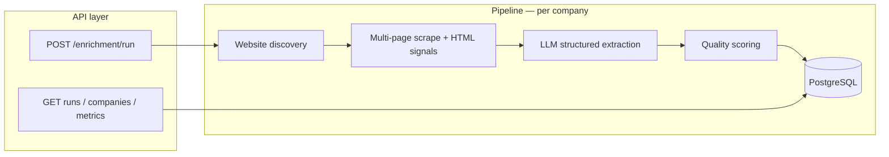

# Data Extraction & Enrichment Pipeline

## From raw company names to structured enrichment records

## Batch website discovery | scraping + AI extraction | quality scoring

This repository is a **portfolio-grade case study** in building a batch data pipeline that turns **unstructured prospect lists** (company names only) into **auditable, scored enrichment records** suitable for CRM or downstream analytics—without pretending to replace human judgement on ambiguous accounts.

---

## Problem

Sales and growth teams routinely receive **thousands of company names** with **no firmographics**: no industry, no size band, no tech footprint, no contact hints. Manual research (search → site → skim About/Contact → spreadsheet) takes **minutes per row** and **does not scale**; quality varies by researcher; and CRM imports need **structured fields**, not prose.

This project automates the **repeatable** parts: resolve a public website, extract deterministic signals from HTML, ask an LLM for **validated** structured output, and attach a **quality score** so teams can filter what to trust or review first.

---

## Solution

A **FastAPI** service exposes a batch API: submit a list of company names; the system **discovers** candidate websites (heuristic probes), **scrapes** the homepage and linked common pages (BeautifulSoup), **enriches** with OpenAI using versioned prompts and Pydantic validation, **scores** completeness and consistency, and **persists** runs and per-company rows in **PostgreSQL** (SQLite supported for dev/tests).

Runs are processed **asynchronously** after the HTTP response returns, with **correlation IDs**, **cost limits per run**, and **aggregated metrics** for observability.

---

## Architecture

High-level flow (see `docs/architecture.md` for detail):



---

## Key Features

| Area | What you get |
|------|----------------|
| **Discovery** | Heuristic `https://{slug}.com` / `.io` probes with confidence and candidate trace (no paid search API required for the baseline). |
| **Scraping** | Bounded fetches, nav-linked pages (about/contact/careers/privacy), JSON-LD and visible-text extraction for AI + scoring. |
| **AI** | Structured JSON → `AIEnrichmentResult`; token/cost/latency persisted per row. |
| **Quality** | Composite `final_score` with subscores: completeness, evidence strength, consistency, website confidence. |
| **Operations** | Health/ready, metrics endpoint, alerting hooks (mock notifier in dev), Alembic migrations. |
| **Evaluation** | Offline `make evaluate` against sample YAML with mocked HTTP/AI (`eval/README.md`). |

---

## Tech Stack

| Layer | Choice |
|-------|--------|
| Runtime | Python 3.12+ |
| API | FastAPI, Uvicorn |
| Data | SQLAlchemy 2 async, Alembic, PostgreSQL (asyncpg) or SQLite (aiosqlite) |
| HTTP | httpx |
| HTML | BeautifulSoup4 |
| LLM | OpenAI API (async client + Pydantic validation) |
| Config | pydantic-settings |
| Tests | pytest, pytest-asyncio, coverage; external I/O mocked |

---

## How to Run

```bash
python -m venv .venv && source .venv/bin/activate  # Windows: .venv\Scripts\activate
pip install -r requirements.txt -r requirements-dev.txt
cp .env.example .env   # set DATABASE_URL, OPENAI_API_KEY
alembic upgrade head   # when using PostgreSQL
uvicorn app.main:app --reload --host 0.0.0.0 --port 8000
```

- API base path defaults to **`/api/v1`** (see `API_PREFIX` / `settings.api_prefix`).
- OpenAPI docs: **`/docs`** when `DEBUG=true`.

**Makefile targets:** `make lint`, `make typecheck`, `make test`, `make evaluate`, `make migrate`.

---

## Configuration Guide

Environment variables are loaded via **Pydantic Settings** (see `app/config.py` and `.env.example`). Important groups:

| Concern | Variables (examples) |
|---------|----------------------|
| App | `APP_ENV`, `DEBUG`, `LOG_LEVEL`, `API_PREFIX` |
| Database | `DATABASE_URL` (async URL, e.g. `postgresql+asyncpg://…` or `sqlite+aiosqlite:///…`) |
| OpenAI | `OPENAI_API_KEY`, `OPENAI_MODEL`, `OPENAI_TIMEOUT_SECONDS`, token/temperature limits |
| Cost | `MAX_COST_PER_RUN_USD` — **caps cumulative AI spend per batch run** (pre-check before each enrichment call) |
| HTTP / scrape | `HTTP_*`, `MAX_PAGES_PER_COMPANY`, `PIPELINE_MAX_CONCURRENCY` |
| Discovery | `DISCOVERY_TRY_WWW` |
| Quality / alerts | `QUALITY_PASS_THRESHOLD`, `ALERT_*` |

Full list: **`.env.example`** and **`docs/runbook.md`**.

---

## API Overview

All routes are under **`{api_prefix}`** (default `/api/v1`).

| Method | Path | Purpose |
|--------|------|---------|
| `GET` | `/health` | Liveness |
| `GET` | `/health/ready` | Readiness (DB `SELECT 1`) |
| `GET` | `/metrics` | Aggregated pipeline metrics + DB pool stats |
| `POST` | `/enrichment/run` | Body: `{ "companies": ["Name1", …] }` (1–500 names); schedules background pipeline |
| `GET` | `/runs` | Paginated enrichment runs |
| `GET` | `/companies` | Paginated company records |
| `GET` | `/companies/{company_id}` | Full record with JSON payloads |

Optional header: **`X-Correlation-ID`** for tracing.

Request/response models: **`app/api/schemas.py`**.

---

## Evaluation / Demo Flow

1. Sample inputs: **`data/sample_run/companies.yaml`** and **`data/sample_run/expected_enrichment.yaml`** (mirrored under `tests/fixtures/sample_inputs/`).
2. Run **`make evaluate`** — executes the **production** pipeline with **mocked** HTTP and OpenAI; writes **`eval/reports/evaluation_report.md`** and **`evaluation_summary.json`**.
3. Diagrams: **`eval/pipeline-dag.mmd`**, **`eval/README.md`**.

---

## Testing

```bash
make lint && make typecheck && make test
```

- **Unit** tests cover parsers, quality scoring, OpenAI client behaviour (mocked), etc.
- **Integration** tests run the full pipeline against **SQLite** with **mocked** web and AI clients (`tests/conftest.py`).
- **Coverage** gate: **80%** on `app/` (see `pyproject.toml` / Makefile).

---

## Future Improvements

- Paid **search-assisted discovery** for ambiguous brands (ADR 001).
- Stronger **SSRF** controls (DNS resolution checks for redirects).
- **Circuit breaker** and richer HTTP retries per ADR 005 (partially aspirational today).
- **Resume** failed rows within a run and explicit **idempotency** keys for duplicate submissions.
- Export connectors (CSV/S3) and **review UI** for low-confidence rows.

---

## Documentation index

| Document | Contents |
|----------|----------|
| `docs/problem-definition.md` | Business context, inputs/outputs, success criteria |
| `docs/architecture.md` | System components, data flow, failure modes |
| `docs/runbook.md` | Health, failures, tuning, evaluation |
| `docs/decisions/` | ADRs (discovery, AI, quality, storage, retries) |
| `CHANGELOG.md` | Version history |
| `eval/README.md` | Offline evaluation workflow |

---

## License / portfolio

Built as a **demonstration** of batch pipeline design, async Python, LLM integration with validation, and data quality scoring—not a commercial product. Adapt policies and compliance to your org before production use.
