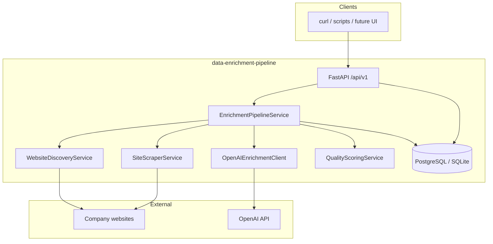
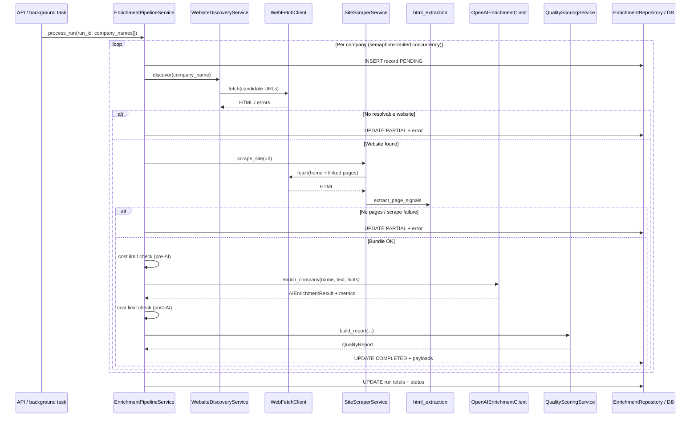

# Architecture: Data Extraction & Enrichment Pipeline

## Overview

This system is a **batch-oriented enrichment pipeline** exposed through a **FastAPI** service. Given company names, it **discovers websites** (heuristic HTTP probes), **scrapes public HTML** with **BeautifulSoup**, calls the **OpenAI API** to **extract and classify** structured firmographics, computes a **composite data quality score**, and **persists** runs and per-company results in **PostgreSQL** (or **SQLite** for development and tests).

## Goals (in scope)

- End-to-end flow: **name → URL discovery → multi-page scrape → LLM structured output → quality score → stored enriched record**.
- **Async I/O** for HTTP and database; **CPU-bound** HTML parsing runs on the event loop with bounded input sizes.
- **Configuration** via environment variables (`pydantic-settings`); **no secrets in code**.
- **Observability:** correlation IDs, structured logging, health/ready/metrics endpoints.

## System context

## Detailed pipeline (single company)

This diagram matches the **implemented** orchestration in `app/services/enrichment_pipeline.py`:

**Run-level status** (`EnrichmentRun`): `pending` → `running` → `completed` | `failed` | `partial` (some rows failed or partial).

**Record-level status** (`EnrichmentRecord`): `pending` → `completed` | `partial` | `failed` (including cost limit failures).

## Component responsibilities

| Layer | Responsibility |
|-------|----------------|
| **Routes** (`app/api/routes/`) | Validate requests; schedule `process_run` in background; paginated list/detail endpoints. |
| **Pipeline service** | Semaphore-limited concurrency; per-row processing; cost accounting; run aggregates; optional alerting. |
| **Website discovery** | From company name, probe `{slug}.com` / `.io` with `www` variants; return URL + confidence + candidates tried (ADR 001). |
| **Site scraper** | Homepage + nav-linked about/contact/careers/privacy; aggregate `ScrapedSiteBundle`. |
| **HTML extraction** | Deterministic signals: title, meta, headings, emails, phones, JSON-LD, tech hints. |
| **OpenAI client** | Versioned prompts; JSON → `AIEnrichmentResult`; token/cost/latency (ADR 002). |
| **Quality scoring** | Completeness, evidence strength, consistency, website confidence → `final_score` (ADR 003). |
| **Repositories** | Async SQLAlchemy; tables `enrichment_runs`, `enrichment_records` (ADR 004). |

## Data model (implemented)

- **`enrichment_runs`:** batch metadata, status, counts, `total_ai_cost_usd`, timestamps.
- **`enrichment_records`:** per company, `normalized_name_key`, discovery/scrape/AI/quality JSON payloads, error fields, model telemetry.

See migration `migrations/versions/001_enrichment_tables.py`.

## Data flow (batch)

1. **POST `/enrichment/run`** creates an `enrichment_runs` row and enqueues **`process_run(run_id, names)`** via FastAPI `BackgroundTasks`.
2. For each name: insert **`enrichment_records`** (`PENDING`), then discovery → scrape → AI → quality → update row.
3. **Finalize run:** `succeeded_count`, `failed_count`, `total_ai_cost_usd`, terminal run status.

## Failure paths (summary)

| Layer | Typical outcome |
|-------|-------------------|
| Discovery | No HTML candidate → `ScrapeError` → record **partial**. |
| Scrape | No pages / terminal HTTP → **partial**. |
| Cost cap | `CostLimitExceeded` → record **failed** with cost error code. |
| AI | Validation / API errors → **partial** (classified exceptions). |
| Unexpected | Logged; record **failed** with `UNEXPECTED`. |

Retries and circuit breakers are described in ADR 005; the **current** codebase focuses on **mockable** clients and **clear** terminal states—see `docs/runbook.md` for operational detail.

## Security boundaries (summary)

| Boundary | Controls |
|----------|----------|
| Client → API | Pydantic validation; batch size limits (`max_length=500` companies). |
| HTTP fetch | SSRF-oriented host checks in `WebFetchClient` (private IP / localhost patterns). |
| Scrape → LLM | Truncated visible text; no raw HTML stored as primary artifact in the default schema—bundles store structured extraction outputs. |

## Observability

- **Middleware:** `X-Correlation-ID` propagation (`app/api/middleware/correlation.py`).
- **Logs:** structured `extra` with correlation id and run/company context where applicable.
- **Endpoints:** `/health`, `/health/ready`, `/metrics` (see `app/api/routes/health.py`).

## Related documents

- `docs/problem-definition.md`
- `docs/runbook.md`
- `docs/decisions/001-website-discovery-strategy.md`
- `docs/decisions/002-ai-extraction-and-classification-approach.md`
- `docs/decisions/003-data-quality-scoring-framework.md`
- `docs/decisions/004-storage-and-pipeline-run-tracking.md`
- `docs/decisions/005-retry-and-failure-handling-strategy.md`
