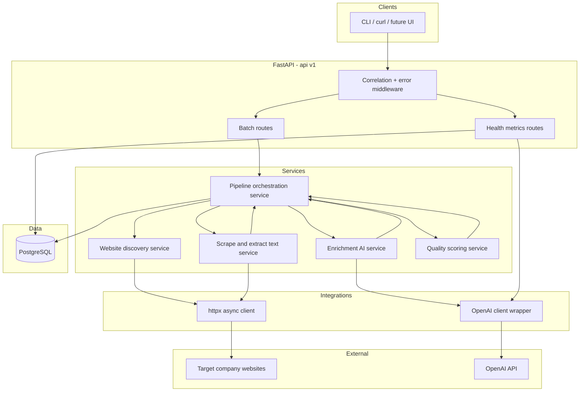

# Architecture: Data Extraction & Enrichment Pipeline

## Overview

This system is a **batch-oriented enrichment pipeline** exposed through a **FastAPI** service. Given company names, it **discovers websites**, **scrapes public HTML** with **BeautifulSoup**, calls the **OpenAI API** to **extract and classify** structured firmographics, computes a **data quality score**, and **persists** runs and per-company results in **PostgreSQL**.

## Goals (in scope)

- End-to-end flow: **name → URL candidates → scrape → LLM structured output → quality score → stored enriched record**.
- **Async I/O** for HTTP and database; **synchronous** BeautifulSoup parsing on fetched HTML (CPU-bound, bounded worker pool or inline with size limits).
- **Configuration** via environment variables (Pydantic Settings); **no secrets in code**.
- **Observability:** correlation IDs, structured logging, health/ready/metrics.

## System Diagram

## Component Responsibilities

| Layer | Responsibility |
|-------|----------------|
| **Routes** | Validate requests; attach correlation id; delegate to services; return Pydantic responses. |
| **Pipeline service** | Orchestrates stages per company; applies retries at orchestration level; writes row-level outcomes. |
| **Website discovery** | From company name, produce ranked URL candidate(s) with signals and confidence (see ADR 001). |
| **Scrape service** | Fetch pages with timeouts/redirect limits; parse visible text and metadata with BeautifulSoup; cap bytes and depth. |
| **Enrichment AI service** | Versioned prompts; OpenAI structured output → Pydantic validation; token/cost logging. |
| **Quality scoring** | Deterministic score from field completeness, consistency, source coverage (see ADR 003). |
| **Repositories** | All SQL through async SQLAlchemy; migrations via Alembic. |

## Data Flow (Single Company)

1. **Ingest:** Batch request creates a `pipeline_run` and N `company_jobs` rows (idempotent per run + normalised name key where applicable).
2. **Discover:** Website discovery returns primary URL + confidence; persist candidate list and chosen URL.
3. **Fetch:** Scraper requests allowlisted paths (home, `/about`, `/contact`, etc.—configurable); aggregates text snippets with source labels.
4. **Enrich:** OpenAI returns JSON matching `EnrichedCompany` schema (industry, size band, tech tags, contacts); validate strictly.
5. **Score:** Quality scorer consumes enriched fields + scrape metadata + discovery confidence; produces numeric score + subscores.
6. **Persist:** Final row status `completed` or `failed`/`partial` with error code and audit fields (model, prompt version, token usage).

## Failure Paths (External Dependencies)

### Target websites (HTTP)

| Condition | Behaviour |
|-----------|-----------|
| DNS / connection errors | Classify retryable; exponential backoff with jitter; max attempts per settings. |
| HTTP 4xx/5xx | Map to scrape failure; optional retry for 502/503 only. |
| Empty or non-HTML | Terminal `partial` or `failed` with reason; never fabricate content. |
| Rate limiting | Per-host throttle + global concurrency cap; backoff. |

**Circuit breaker:** After repeated failures to the **same host** or **global HTTP error burst**, short-circuit further requests for a cooldown window (see ADR 005).

### OpenAI API

| Condition | Behaviour |
|-----------|-----------|
| 429 / rate limit | Respect `retry-after` when present; backoff; count toward run metrics. |
| 5xx / timeout | Retry with cap; distinguish retryable vs fatal. |
| Invalid JSON / schema mismatch | No silent accept; retry once with repair prompt **or** mark failed with validation error logged. |
| Cost limit | Pre-call budget check; stop new LLM calls; run status reflects `cost_limited`. |

**Logging:** Every failure includes `correlation_id`, `company_job_id`, `pipeline_run_id`, and **no full page body**—truncated preview only.

## Security Boundaries

| Boundary | Data crossing | Controls |
|----------|----------------|----------|
| Client → API | Company names, batch metadata | Pydantic validation; size limits; auth optional out of scope unless added. |
| API → HTTP fetch | Request URLs only to discovered hosts | SSRF mitigation: block private IP ranges, `file://`, redirects to internal networks (allowlist + DNS resolution checks as feasible in v1). |
| Scrape → LLM | Public page text snippets | Truncate; strip scripts/styles; optional PII minimisation patterns; prompt injection mitigations (ADR 002). |
| LLM → DB | Structured fields | Schema validation; store raw model output encrypted-at-rest is **out of scope** for v1; store hashes/previews per audit policy. |

## Observability Touchpoints

- **Request middleware:** `X-Correlation-ID` in and out.
- **Logs:** JSON or structured key-value; include run/job identifiers.
- **Metrics endpoint:** counts by status, latency percentiles, OpenAI cost aggregates, scrape success rate.
- **Health/ready:** DB connectivity; optional OpenAI key presence check (without calling production).

## Related Documents

- `docs/decisions/001-website-discovery-strategy.md`
- `docs/decisions/002-ai-extraction-and-classification-approach.md`
- `docs/decisions/003-data-quality-scoring-framework.md`
- `docs/decisions/004-storage-and-pipeline-run-tracking.md`
- `docs/decisions/005-retry-and-failure-handling-strategy.md`
