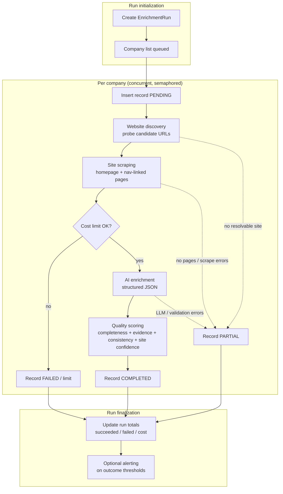

# Evaluation workflow

This directory holds **offline evaluation** for the Data Extraction & Enrichment Pipeline: the same production orchestration (`EnrichmentPipelineService`) runs against YAML-defined company batches while **HTTP and OpenAI are mocked**, so results are reproducible without network access or API spend.

## How to run

From the repository root:

```bash
make evaluate
```

This reads `data/sample_run/companies.yaml`, executes the pipeline, and writes:

- `eval/reports/evaluation_report.md` — human-readable summary (run outcome, per-company quality subscores, expectation checks)
- `eval/reports/evaluation_summary.json` — machine-readable summary for dashboards or CI artifacts
- `eval/reports/.evaluation.sqlite` — ephemeral SQLite DB for the run (gitignored)

Optional flags:

```bash
python -m eval.run_evaluation --help
```

## What is measured

- **Extraction completeness** — quality subscore `completeness` (six AI fields filled vs empty)
- **Quality scores** — `final_score` and subscores (`evidence_strength`, `consistency`, `website_confidence`)
- **Run outcomes** — run status (`completed` / `partial` / `failed`), per-record status, aggregate succeeded/failed counts, total mocked AI cost

Soft expectations live in `data/sample_run/expected_enrichment.yaml` and are checked at the end of the run (non-zero exit if a check fails).

## Pipeline DAG

The Mermaid source is `pipeline-dag.mmd`. Equivalent diagram:



## Sample inputs

Authoritative copies for tests also live under `tests/fixtures/sample_inputs/` (same schema as `data/sample_run/`).
